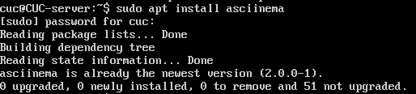
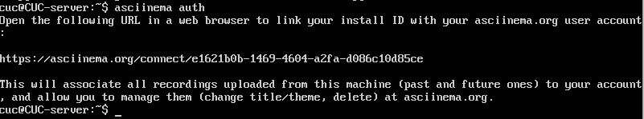

# Vim的基本使用

## 实验目的

* 学会使用`linux`基本命令行，完成`vimtutor`
* 使用`asciinema`上传操作的录屏，在实验报告中附上地址链接

## 实验过程

### 使用`asciinema`进行录屏

* 安装`asciinema`

  ```
  sudo apt install asciinema
  ```

  

* 关联账号`asciinema auth`，点击链接进行登录

  

* 输入`asciinema rec`开始录屏

* 输入`exit`结束录屏，`Enter`进行上传

###  在`Vimtutor`中的练习

* 终端输入`vimtutor`，阅读说明并实践
* 第一节
  * [lesson1](https://asciinema.org/a/ElwNdzZ99f5hcsgmg7f6d2gz0)
* 第二节
  * [lesson2](https://asciinema.org/a/EjinyXGSanBfROHJGm8dW7ubp)
* 第三~五节
  * [lesson3~5](https://asciinema.org/a/FbE2xirCUvjPP7Pdz5IkMsMZG)
* 第六节
  * [lesson6](https://asciinema.org/a/3hX3rVjjAVnp2OqIpThH865u)
* 第七节
  * [lesson7](https://asciinema.org/a/Rna7CqmVpUB28WPFUsk8plc9f)

### `Vimtutor`完成后的自查清单

- 你了解`vim`有哪几种工作模式？
  - 正常模式
  - 插入模式
  - 可视模式
  - 命令行模式
- Normal模式下，从当前行开始，一次向下移动光标10行的操作方法？如何快速移动到文件开始行和结束行？如何快速跳转到文件中的第N行？
  - 一次向下移动光标10行：`10j`
  - 移动到文件开始行：`gg`
  - 移动到文件结束行：`G`
  - 快速跳转到第N行：`NG`（N为行数）
- Normal模式下，如何删除单个字符、单个单词、从当前光标位置一直删除到行尾、单行、当前行开始向下数N行？
  - 删除单个字符: `x`或键盘上的`Del`键
  - 删除单个单词：`dw`
  - 从当前光标位置一直到行尾：`d$`
  - 删除单行：`dd`
  - 删除当前行开始向下数N行：`Ndd`
- 如何在vim中快速插入N个空行？如何在vim中快速输入80个-？
  - 快速插入N个空行：`No`
  - 快速输入80个-：`80i- [ESC]`
- 如何撤销最近一次编辑操作？如何重做最近一次被撤销的操作？
  - 撤销最近一次编辑操作：`u`
  - 重做撤销操作：`ctrl+R`
- vim中如何实现剪切粘贴单个字符？单个单词？单行？如何实现相似的复制粘贴操作呢？
  - 单个字符：`xp`
  - 单个单词：`dwp`
  - 单行：`ddp`
  - 相似的复制粘贴操作：
    - 按`v` 进入 `visual` 模式
    - 选择要复制的内容
      - `^` 选中当前行，光标位置到行首
      - `$` 选中当前行，光标位置到行尾
      - `w` 到下一个单词首
    - `y` 进行复制
    - `ESC` 退回到`normal`模式
    - `p` 粘贴
- 为了编辑一段文本你能想到哪几种操作方式（按键序列）？
  - 终端输入`vim filename`
  - `a`、`i`、`A`都会进入插入模式，惟一的区别在于字符插入的位置。
  - `c`改变当前字符
  - `d/D`删除文本
  - `o/O`向下/向上插入一行并编辑
  - `r/R`替换当前字符
  - 完成编辑后输入：`:wq!`保存
- 查看当前正在编辑的文件名的方法？查看当前光标所在行的行号的方法？
  - `Ctrl+G`
- 在文件中进行关键词搜索你会哪些方法？如何设置忽略大小写的情况下进行匹配搜索？如何将匹配的搜索结果进行高亮显示？如何对匹配到的关键词进行批量替换？
  - 关键词搜索：`/keyword` 或 `?keyword`
  - 忽略大小写：`:set ic`
  - 高亮显示：`:set hls is`
  - 对关键词批量替换：`:%s/old/new/g`
- 在文件中最近编辑过的位置来回快速跳转的方法？
  - 向前跳转：`Ctrl+I`
  - 向后跳转：`Ctrl+O`
- 如何把光标定位到各种括号的匹配项？例如：找到(, [, or {对应匹配的),], or }
  - 按`%`匹配光标指向的括号的匹配括号
- 在不退出vim的情况下执行一个外部程序的方法？
  - `:!+外部程序命令`
- 如何使用vim的内置帮助系统来查询一个内置默认快捷键的使用方法？如何在两个不同的分屏窗口中移动光标？
  - 提供一个正确的参数给`:help`命令，您可以找到关于该主题的帮助，例如输入 `:help cmd` 可以找到关于 `cmd `命令的帮助。
  - `Crtl+W`

## 参考资料

* [vimtutor——vim官方教程](https://www.cnblogs.com/YooHoeh/p/10659695.html)
* [课程视频](https://space.bilibili.com/388851616/channel/detail?cid=103824)
* [开源课件](https://github.com/c4pr1c3/LinuxSysAdmin)


