# Linux服务器系统管理

## 实验目的

* Systemed入门学习，完成linux开机自启动项管理

## 实验环境

* Ubuntu 18.04 Server

## 实验过程

### Systemd命令篇

* 系统管理

  * Systemctl

    systemctl是sysyemd的主命令，用于管理系统

    ```bash
    # 重启系统
    $ sudo systemctl reboot
    
    # 关闭系统，切断电源
    $ sudo systemctl poweroff
    
    # CPU停止工作
    $ sudo systemctl halt
    
    # 暂停系统
    $ sudo systemctl suspend
    
    # 让系统进入冬眠状态
    $ sudo systemctl hibernate
    
    # 让系统进入交互式休眠状态
    $ sudo systemctl hybrid-sleep
    
    # 启动进入救援状态（单用户状态）
    $ sudo systemctl rescue
    ```

  * systemd-analyze

    `systemd-analyze`命令用于查看启动耗时。

    ```bash
    # 查看启动耗时
    $ systemd-analyze           
    
    # 查看每个服务的启动耗时
    $ systemd-analyze blame
    
    # 显示瀑布状的启动过程流
    $ systemd-analyze critical-chain
    
    # 显示指定服务的启动流
    $ systemd-analyze critical-chain atd.service
    ```

  * hostnamectl

    `hostnamectl`命令用于查看当前主机的信息。

    ```bash
    # 显示当前主机的信息
    $ hostnamectl
    
    # 设置主机名。
    $ sudo hostnamectl set-hostname rhel7
    ```

  * localectl

    `localectl`命令用于查看本地化设置。

    ```bash
    # 查看本地化设置
    $ localectl
    # 设置本地化参数。
    $ sudo localectl set-locale LANG=en_GB.utf8
    $ sudo localectl set-keymap en_GB
    ```

  * timedatectl

    `timedatectl`命令用于查看当前时区设置。

    ```bash
    # 查看当前时区设置
    $ timedatectl
    
    # 显示所有可用的时区
    $ timedatectl list-timezones
    
    # 设置当前时区
    $ sudo timedatectl set-timezone America/New_York
    $ sudo timedatectl set-time YYYY-MM-DD
    $ sudo timedatectl set-time HH:MM:SS
    ```

  * loginctl

    `loginctl`命令用于查看当前登录的用户。

    ```bash
    # 列出当前session
    $ loginctl list-sessions
    
    # 列出当前登录用户
    $ loginctl list-users
    
    # 列出显示指定用户的信息
    $ loginctl show-user cuc
    ```

  * 操作视频

    https://asciinema.org/a/nLOtYeEcIDsPcdQBDLIA1Jdqu

* Unit

  * `systemctl list-units`命令可以查看当前系统的所有 Unit 。

    ```bash
    # 列出正在运行的 Unit
    $ systemctl list-units
    
    # 列出所有Unit，包括没有找到配置文件的或者启动失败的
    $ systemctl list-units --all
    
    # 列出所有没有运行的 Unit
    $ systemctl list-units --all --state=inactive
    
    # 列出所有加载失败的 Unit
    $ systemctl list-units --failed
    
    # 列出所有正在运行的、类型为 service 的 Unit
    $ systemctl list-units --type=service
    ```

  * `systemctl status`命令用于查看系统状态和单个 Unit 的状态。

    ```bash
    # 显示系统状态
    $ systemctl status
    
    # 显示单个 Unit 的状态
    $ sysystemctl status bluetooth.service
    
    # 显示远程主机的某个 Unit 的状态
    $ systemctl -H root@rhel7.example.com status httpd.service
    ```

  * 对于用户来说，最常用的是下面这些命令，用于启动和停止 Unit（主要是 service）。

    ```bash
    # 立即启动一个服务
    $ sudo systemctl start apache.service
    
    # 立即停止一个服务
    $ sudo systemctl stop apache.service
    
    # 重启一个服务
    $ sudo systemctl restart apache.service
    
    # 杀死一个服务的所有子进程
    $ sudo systemctl kill apache.service
    
    # 重新加载一个服务的配置文件
    $ sudo systemctl reload apache.service
    
    # 重载所有修改过的配置文件
    $ sudo systemctl daemon-reload
    
    # 显示某个 Unit 的所有底层参数
    $ systemctl show httpd.service
    
    # 显示某个 Unit 的指定属性的值
    $ systemctl show -p CPUShares httpd.service
    
    # 设置某个 Unit 的指定属性
    $ sudo systemctl set-property httpd.service CPUShares=500
    ```

  * Unit 之间存在依赖关系：A 依赖于 B，就意味着 Systemd 在启动 A 的时候，同时会去启动 B。

    `systemctl list-dependencies`命令列出一个 Unit 的所有依赖。

    ```bash
    $ systemctl list-dependencies nginx.service
    ```

    上面命令的输出结果之中，有些依赖是 Target 类型（详见下文），默认不会展开显示。如果要展开 Target，就需要使用`--all`参数。

    ```bash
    $ systemctl list-dependencies --all nginx.service
    ```

  * 操作视频

    https://asciinema.org/a/LWT9ChdCh73tbY5QDgVJb5uOD

* Unit 的配置文件

  每一个 Unit 都有一个配置文件，告诉 Systemd 怎么启动这个 Unit 。

  Systemd 默认从目录`/etc/systemd/system/`读取配置文件。但是，里面存放的大部分文件都是符号链接，指向目录`/usr/lib/systemd/system/`，真正的配置文件存放在那个目录。

  * `systemctl enable`命令用于在上面两个目录之间，建立符号链接关系。

    ```bash
    $ sudo systemctl enable clamd@scan.service
    # 等同于
    $ sudo ln -s '/usr/lib/systemd/system/clamd@scan.service' '/etc/systemd/system/multi-user.target.wants/clamd@scan.service'
    ```

  * 如果配置文件里面设置了开机启动，`systemctl enable`命令相当于激活开机启动。

    与之对应的，`systemctl disable`命令用于在两个目录之间，撤销符号链接关系，相当于撤销开机启动。

    ```bash
    $ sudo systemctl disable clamd@scan.service
    ```

    配置文件的后缀名，就是该 Unit 的种类，比如`sshd.socket`。如果省略，Systemd 默认后缀名为`.service`，所以`sshd`会被理解成`sshd.service`。

  * `systemctl list-unit-files`命令用于列出所有配置文件。

    ```bash
    # 列出所有配置文件
    $ systemctl list-unit-files
    
    # 列出指定类型的配置文件
    $ systemctl list-unit-files --type=service
    ```

    列表会显示每个配置文件的状态，一共有四种。

    - enabled：已建立启动链接
    - disabled：没建立启动链接
    - static：该配置文件没有`[Install]`部分（无法执行），只能作为其他配置文件的依赖
    - masked：该配置文件被禁止建立启动链接

    注意，从配置文件的状态无法看出，该 Unit 是否正在运行。这必须执行前面提到的`systemctl status`命令。

    ```bash
    $ systemctl status bluetooth.service
    ```

    一旦修改配置文件，就要让 systemd重新加载配置文件，然后重新启动，否则修改不会生效。

    ```bash
    $ sudo systemctl daemon-reload
    $ sudo systemctl restart httpd.service
    ```

  * `systemctl cat`命令可以查看配置文件的内容。

    ```bash
    $ systemctl cat atd.service
    
    [Unit]
    Description=ATD daemon
    
    [Service]
    Type=forking
    ExecStart=/usr/bin/atd
    
    [Install]
    WantedBy=multi-user.target
    ```

    

  * 操作视频

    https://asciinema.org/a/sHx6IZ6oppVD941AIZevvxKZg

* Target

  启动计算机的时候，需要启动大量的 Unit。如果每一次启动，都要一一写明本次启动需要哪些 Unit，显然非常不方便。Systemd 的解决方案就是 Target。

  简单说，Target 就是一个 Unit 组，包含许多相关的 Unit 。启动某个 Target 的时候，Systemd 就会启动里面所有的 Unit。从这个意义上说，Target 这个概念类似于"状态点"，启动某个 Target 就好比启动到某种状态。

  传统的`init`启动模式里面，有 RunLevel 的概念，跟 Target 的作用很类似。不同的是，RunLevel 是互斥的，不可能多个 RunLevel 同时启动，但是多个 Target 可以同时启动。

  ```bash
  # 查看当前系统的所有 Target
  $ systemctl list-unit-files --type=target
  
  # 查看一个 Target 包含的所有 Unit
  $ systemctl list-dependencies multi-user.target
  
  # 查看启动时的默认 Target
  $ systemctl get-default
  
  # 设置启动时的默认 Target
  $ sudo systemctl set-default multi-user.target
  
  # 切换 Target 时，默认不关闭前一个 Target 启动的进程，
  # systemctl isolate 命令改变这种行为，
  # 关闭前一个 Target 里面所有不属于后一个 Target 的进程
  $ sudo systemctl isolate multi-user.target
  ```

  * 操作视频

    https://asciinema.org/a/G3j80qDblDxRwu2ftqSpYYevu

* 日志管理

  Systemd 统一管理所有 Unit 的启动日志。带来的好处就是，可以只用`journalctl`一个命令，查看所有日志（内核日志和应用日志）。日志的配置文件是`/etc/systemd/journald.conf`。

  `journalctl`功能强大，用法非常多。

  ```bash
  # 查看所有日志（默认情况下 ，只保存本次启动的日志）
  $ sudo journalctl
  
  # 查看内核日志（不显示应用日志）
  $ sudo journalctl -k
  
  # 查看系统本次启动的日志
  $ sudo journalctl -b
  $ sudo journalctl -b -0
  
  # 查看上一次启动的日志（需更改设置）
  $ sudo journalctl -b -1
  
  # 查看指定时间的日志
  $ sudo journalctl --since="2020-3-12 18:17:16"
  $ sudo journalctl --since "20 min ago"
  $ sudo journalctl --since yesterday
  $ sudo journalctl --since "2015-01-10" --until "2015-01-11 03:00"
  $ sudo journalctl --since 09:00 --until "1 hour ago"
  
  # 显示尾部的最新10行日志
  $ sudo journalctl -n
  
  # 显示尾部指定行数的日志
  $ sudo journalctl -n 20
  
  # 实时滚动显示最新日志
  $ sudo journalctl -f
  
  # 查看指定服务的日志
  $ sudo journalctl /lib/systemd/systemd
  
  # 查看指定进程的日志
  $ sudo journalctl _PID=1
  
  # 查看某个路径的脚本的日志
  $ sudo journalctl /bin/bash
  
  # 查看指定用户的日志
  $ sudo journalctl _UID=33 --since today
  
  # 查看某个 Unit 的日志
  $ sudo journalctl -u nginx.service
  $ sudo journalctl -u nginx.service --since today
  
  # 实时滚动显示某个 Unit 的最新日志
  $ sudo journalctl -u nginx.service -f
  
  # 合并显示多个 Unit 的日志
  $ journalctl -u nginx.service -u php-fpm.service --since today
  
  # 查看指定优先级（及其以上级别）的日志，共有8级
  # 0: emerg
  # 1: alert
  # 2: crit
  # 3: err
  # 4: warning
  # 5: notice
  # 6: info
  # 7: debug
  $ sudo journalctl -p err -b
  
  # 日志默认分页输出，--no-pager 改为正常的标准输出
  $ sudo journalctl --no-pager
  
  # 以 JSON 格式（单行）输出
  $ sudo journalctl -b -u nginx.service -o json
  
  # 以 JSON 格式（多行）输出，可读性更好
  $ sudo journalctl -b -u nginx.serviceqq
   -o json-pretty
  
  # 显示日志占据的硬盘空间
  $ sudo journalctl --disk-usage
  
  # 指定日志文件占据的最大空间
  $ sudo journalctl --vacuum-size=1G
  
  # 指定日志文件保存多久
  $ sudo journalctl --vacuum-time=1years
  ```

  * 操作视频

    https://asciinema.org/a/KCIgI7HPbFrVfkgiPCie1b2O9

### Systemd实战篇

* [](https://asciinema.org/a/7haauzqwFMtv5rNxZgXIUU76)

  [](https://asciinema.org/a/132560)

* [](https://asciinema.org/a/DJMx0w6NhRvAIhEzyEnpAWY4Y)

### 自查清单

* 如何添加一个用户并使其具备sudo执行程序的权限？

  * ```bash
    # 切换到root用户
    sudo su -
    # 添加test用户
    adduser test
    # 将test用户添加到sudo用户组[需要在有sudo权限的用户下操作]
    sudo usermod -a -G sudo test
    ```

  * 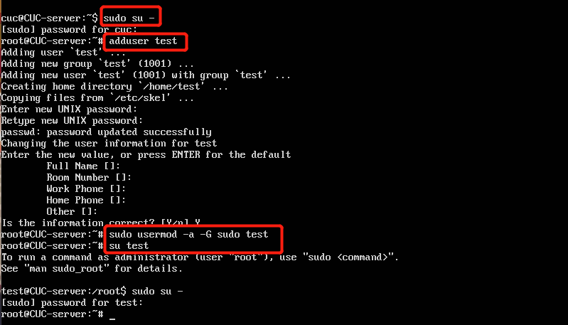

* 如何将一个用户添加到一个用户组？

  * ```bash
    sudo usermod -a -G groupname username
    ```

* 如何查看当前系统的分区表和文件系统详细信息？

  * 查看当前系统分区表:`sudo fdisk -l`

  * 文件系统详细信息:`df -a`

  * 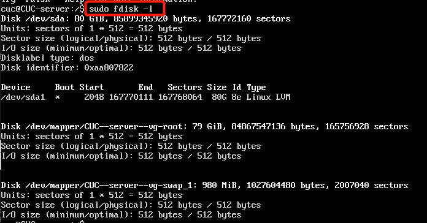

    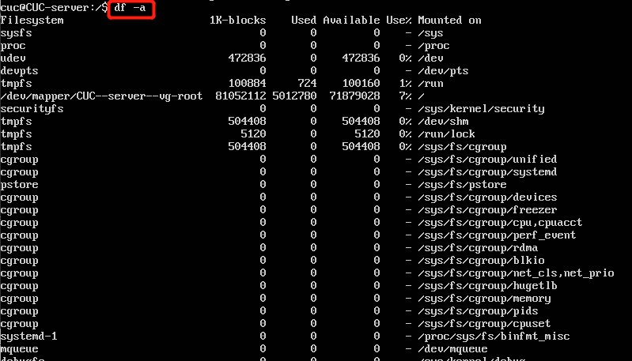

* 如何实现开机自动挂载Virtualbox的共享目录分区？

  * VirtualBox中选择设置->共享文件夹->添加共享文件夹，选择要和虚拟机共享的文件夹，不要勾选自动挂载

    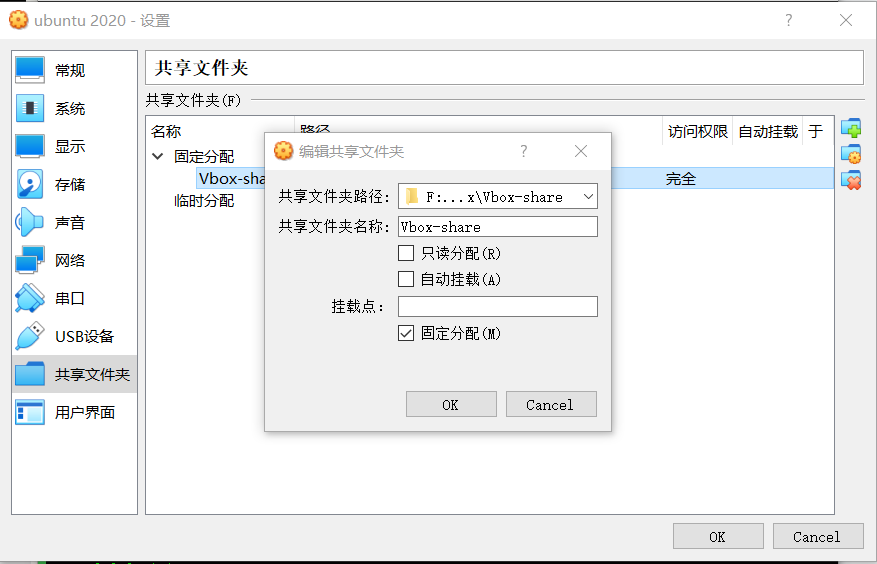

  * ```bash
    # 在虚拟机内进行相关设置
    
     # 创建挂载目录
     sudo mkdir /mnt/shared
    
     #安装增强功能
     sudo apt install nfs-common
     sudo apt install cifs-utils
     sudo apt install virtualbox-guest-utils
    #挂载文件夹
     sudo mount -t vboxsf Vbox-share /mnt/shared
    
     # 修改配置
     sudo vim /etc/fstab
     # 配置内容如下
     Vbox-share /mnt/shared vboxsf defaults 0 0
    #写入这一条命令时，在改行的开头，一定要空一格，不知道原因，反正不然无效。
     # 重启
     reboot
     
     df #查看文件状态及位置等信息，并进入对应文件夹查看是否挂载成功
    ```

    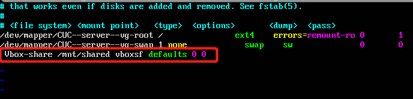

    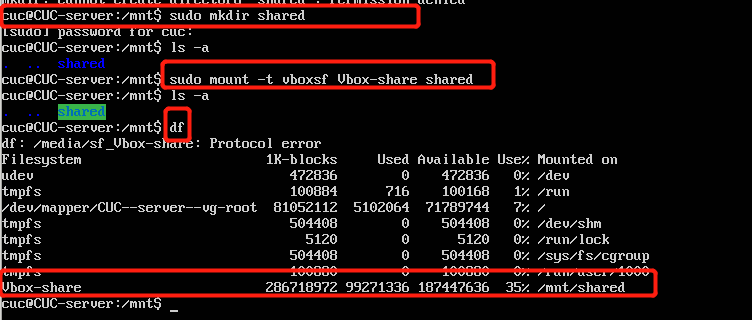

    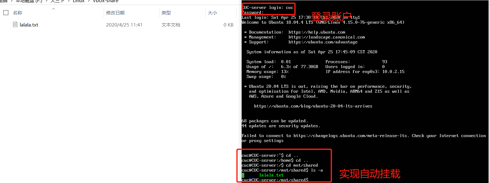

* 基于LVM（逻辑分卷管理）的分区如何实现动态扩容和缩减容量？

  * ```bash
    # 逻辑卷信息
    lvdisplay
    # 扩容
    lvextend -L +32M /dev/ubuntu18-vg/root
    # 缩容
    lvreduce -L +32M /dev/ubuntu18-vg/root
    ```

  * 缩减容量可能会导致数据损坏

* 如何通过systemd设置实现在网络连通时运行一个指定脚本，在网络断开时运行另一个脚本？

  * ```bash
    # 对配置文件/lib/systemd/system/systemd-networkd.service进行更改
    
    # 在service段添加ExecStartPost,ExecStopPost
    ExecStartPost=/bin/sh -c "echo up"
    ExecStopPost=/bin/sh -c "echo down"
    
    # 重载
    systemctl daemon-reload
    ```

    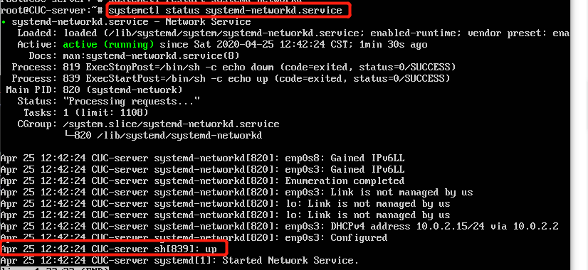

    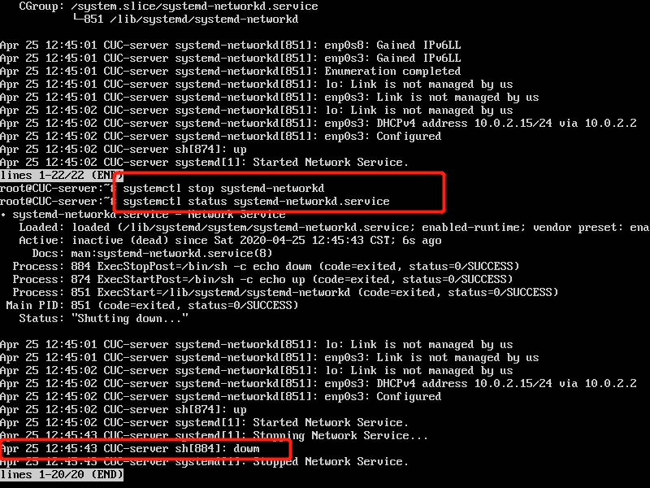

* 如何通过systemd设置实现一个脚本在任何情况下被杀死之后会立即重新启动？实现***杀不死***？

  * 设置相关脚本配置文件中`Restart = always`（此处使用前一题的配置文件）

    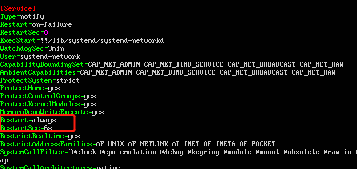

    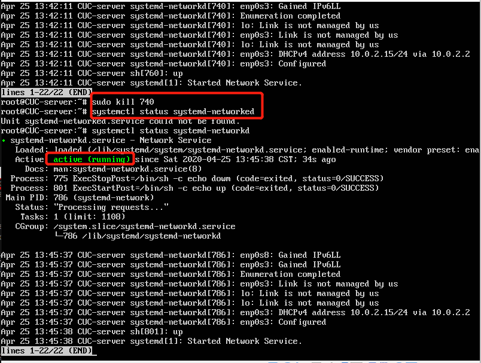

## 出现的问题

* 设置时间时，报错：`Failed to set time: Automatic time synchronization is enabled`

  使用`timedatectl set-ntp 0`关闭`set-ntp server`

* 设置共享文件夹开机自动挂载时失败

  

  将共享文件夹挂载目录改至`/mnt/shared`，在设置里取消自动挂载，并在`/etc/fstab`配置文件中增加的那条语句开头空一格

* 配置文件重载`systemctl daemon-reload`命令运行失败。显示`Failed to connect to bus`

  改为`sudo systemctl daemon-reload`命令运行

## 参考资料

* [Systemd 入门教程：命令篇 by 阮一峰的网络日志](http://www.ruanyifeng.com/blog/2016/03/systemd-tutorial-commands.html)
* [Systemd 入门教程：实战篇 by 阮一峰的网络日志](http://www.ruanyifeng.com/blog/2016/03/systemd-tutorial-part-two.html)
* [共享文件夹自动挂载](https://blog.csdn.net/baidu_31788709/article/details/89154265)


