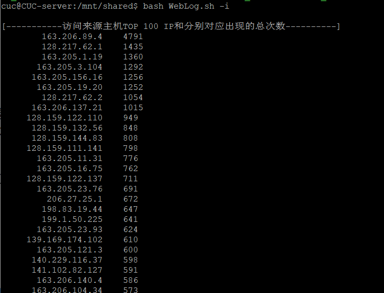

# Shell脚本编程基础

## 实验目的

* 使用shell脚本进行编程

## 实验内容

* 任务一：用bash编写一个图片批处理脚本，实现以下功能：
  * 支持命令行参数方式使用不同功能
  * 支持对指定目录下所有支持格式的图片文件进行批处理
  * 支持以下常见图片批处理功能的单独使用或组合使用
    * 支持对jpeg格式图片进行图片质量压缩
    * 支持对jpeg/png/svg格式图片在保持原始宽高比的前提下压缩分辨率
    * 支持对图片批量添加自定义文本水印
    * 支持批量重命名（统一添加文件名前缀或后缀，不影响原始文件扩展名）
    * 支持将png/svg图片统一转换为jpg格式图片

* 任务二：用bash编写一个文本批处理脚本，对以下附件分别进行批量处理完成相应的数据统计任务：
  - 2014世界杯运动员数据
    - 统计不同年龄区间范围（20岁以下、[20-30]、30岁以上）的球员**数量**、**百分比**
    - 统计不同场上位置的球员**数量**、**百分比**
    - 名字最长的球员是谁？名字最短的球员是谁？
    - 年龄最大的球员是谁？年龄最小的球员是谁？

- 任务三：用bash编写一个文本批处理脚本，对以下附件分别进行批量处理完成相应的数据统计任务：
  - Web服务器访问日志
    - 统计访问来源主机TOP 100和分别对应出现的总次数
    - 统计访问来源主机TOP 100 IP和分别对应出现的总次数
    - 统计最频繁被访问的URL TOP 100
    - 统计不同响应状态码的出现次数和对应百分比
    - 分别统计不同4XX状态码对应的TOP 10 URL和对应出现的总次数
    - 给定URL输出TOP 100访问来源主机

   

## 实验环境

* ubuntu-18.04.1-server-amd64

## 实验过程

* 任务一

  [实验代码](https://www.baidu.com)

  

  ```bash
  # 对jpeg格式图片进行图片质量压缩
  bash image.sh -f sample.jpg -cs 20
  
  # 对jpeg/png/svg格式图片在保持原始宽高比的前提下压缩分辨率
  bash image.sh -f sample.jpg -cq 20
  
  # 对图片添加自定义文本水印
  bash image.sh -f sample.jpg -tw testworkmark
  
  # 对图片重命名
  bash image.sh -f sample.jpg -pr test
  bash image.sh -f sample.jpg -sr test
  
  #png/svg图片统一转换为jpg格式图片
  bash image.sh -f sample.jpg -ctj
  ```

  

* 任务二

  [实验代码](https://www.baidu.com)

  

* 任务三

  ```bash
  #安装P7zip-full
  sudo apt-get install p7zip-full
  #解压缩
  7z x web_log.tsv.7z
  ```

  [实验代码](https://www.baidu.com)

  实验结果

  

  

  

  

  

  

## 参考资料

* [bash编程](http://tldp.org/HOWTO/Bash-Prog-Intro-HOWTO.html)
* [菜鸟教程 - Shell](https://www.runoob.com/linux/linux-shell.html)
* [菜鸟教程 - Linux sort](https://www.runoob.com/linux/linux-comm-sort.html)
* [awk 的特殊模式 BEGIN 和 END](https://linux.cn/article-7654-1.html)
* [awk入门教程 ](http://www.ruanyifeng.com/blog/2018/11/awk.html)
* [imagemagick](http://xpt.sourceforge.net/techdocs/media/image/imagemagick/im04-TextHandling/ar01s02.html)