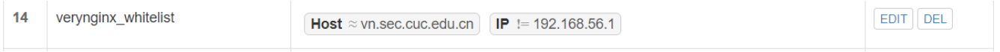

# 搭建Web服务器

## 实验目的

### 基本要求

- 在一台主机（虚拟机）上同时配置Nginx和VeryNginx 

  -  VeryNginx作为本次实验的Web App的反向代理服务器和WAF
  -  PHP-FPM进程的反向代理配置在nginx服务器上，VeryNginx服务器不直接配置Web站点服务
- 使用[Wordpress](https://wordpress.org/)搭建的站点对外提供访问的地址为： [http://wp.sec.cuc.edu.cn](http://wp.sec.cuc.edu.cn/)
- 使用[Damn Vulnerable Web Application (DVWA)](http://www.dvwa.co.uk/)搭建的站点对外提供访问的地址为： [http://dvwa.sec.cuc.edu.cn](http://dvwa.sec.cuc.edu.cn/)

### 安全加固要求

- 使用IP地址方式均无法访问上述任意站点，并向访客展示自定义的**友好错误提示信息页面-1**
- [Damn Vulnerable Web Application (DVWA)](http://www.dvwa.co.uk/)只允许白名单上的访客来源IP，其他来源的IP访问均向访客展示自定义的**友好错误提示信息页面-2**
- 在不升级Wordpress版本的情况下，通过定制[VeryNginx](https://github.com/alexazhou/VeryNginx)的访问控制策略规则，**热**修复[WordPress < 4.7.1 - Username Enumeration](https://www.exploit-db.com/exploits/41497/)
- 通过配置[VeryNginx](https://github.com/alexazhou/VeryNginx)的Filter规则实现对[Damn Vulnerable Web Application (DVWA)](http://www.dvwa.co.uk/)的SQL注入实验在低安全等级条件下进行防护

### VeryNginx配置要求

- [VeryNginx](https://github.com/alexazhou/VeryNginx)的Web管理页面仅允许白名单上的访客来源IP，其他来源的IP访问均向访客展示自定义的**友好错误提示信息页面-3**

- 通过定制

  VeryNginx

  的访问控制策略规则实现： 

  - 限制DVWA站点的单IP访问速率为每秒请求数 < 50
  - 限制Wordpress站点的单IP访问速率为每秒请求数 < 20
  - 超过访问频率限制的请求直接返回自定义**错误提示信息页面-4**
  - 禁止curl访问

## 实验环境

* Ubuntu 18.04 server
* [Nginx](http://nginx.org/)
* [VeryNginx](https://github.com/alexazhou/VeryNginx)
* Wordpress 
  - [WordPress 4.7](https://wordpress.org/wordpress-4.7.zip) | [备用下载地址](https://github.com/WordPress/WordPress/archive/4.7.zip)
* [Damn Vulnerable Web Application (DVWA)](http://www.dvwa.co.uk/)

## 实验过程

### 搭建实验环境

* 配置`VeryNginx`

  * 安装`git`

    ```shell
    sudo apt install git
    #登录git账号
    git config --global user.name "Your Name"
    git config --global user.email "youremail@domain.com"
    ```

  * 将`VeryNginx`仓库克隆到本地

    ```shell
    git clone https://github.com/alexazhou/VeryNginx.git
    ```

  * 添加依赖

    ```shell
    sudo apt install libssl1.0-dev
    sudo apt-get install libpcre3 libpcre3-dev libssl-dev build-essential
    sudo apt install zlib1g-dev
    ```

  * 在本地`VeryNginx`仓库的目录下，执行`install/py`

    ```shell
    sudo python install.py install
    ```

  * 修改`/opt/verynginx/openresty/nginx/conf/nginx.conf`配置文件，将`server`模块的监听端口改为8087

  * 修改主机`hosts`文件，添加`192.168.56.101 vn.sec.cuc.edu.cn`

  * 登录，用户名和密码都为`verynginx`

    
    
    

* 配置`Nginx`

  ```shell
  Install the prerequisites:
  
  sudo apt install curl gnupg2 ca-certificates lsb-release
  To set up the apt repository for stable nginx packages, run the following command:
  
  echo "deb http://nginx.org/packages/ubuntu `lsb_release -cs` nginx" \
      | sudo tee /etc/apt/sources.list.d/nginx.list
  If you would like to use mainline nginx packages, run the following command instead:
  
  echo "deb http://nginx.org/packages/mainline/ubuntu `lsb_release -cs` nginx" \
      | sudo tee /etc/apt/sources.list.d/nginx.list
  Next, import an official nginx signing key so apt could verify the packages authenticity:
  
  curl -fsSL https://nginx.org/keys/nginx_signing.key | sudo apt-key add -
  Verify that you now have the proper key:
  
  sudo apt-key fingerprint ABF5BD827BD9BF62
  The output should contain the full fingerprint 573B FD6B 3D8F BC64 1079 A6AB ABF5 BD82 7BD9 BF62 as follows:
  
  pub   rsa2048 2011-08-19 [SC] [expires: 2024-06-14]
        573B FD6B 3D8F BC64 1079  A6AB ABF5 BD82 7BD9 BF62
  uid   [ unknown] nginx signing key <signing-key@nginx.com>
  To install nginx, run the following commands:
  
  sudo apt update
  sudo apt install nginx
  ```

  - 更改配置文件，` /etc/nginx/sites-enabled/default`将监听端口改为`8080`

* 配置`WordPress`

  * 下载`mysql``php`和相关拓展

    ```shell
    # 安装数据库
    sudo apt install mysql-server
    # 检查是否正常运行，默认下无密码
    sudo mysql -u root -p
    
    #安装php和相关扩展
    sudo apt install php-fpm php-mysql
    sudo apt install php-curl php-gd php-intl php-mbstring php-soap php-xml php-xmlrpc php-zip
    #重启php7.2-fpm
    sudo systemctl restart php7.2-fpm
    ```

    

  * 配置数据库

    ```shell
    # mysql新建数据库
     sudo mysql -u root -p
    > CREATE DATABASE wordpress DEFAULT CHARACTER SET utf8 COLLATE utf8_unicode_ci;
    > GRANT ALL ON wordpress.* TO 'wpuser'@'localhost' IDENTIFIED BY '111111';
    > FLUSH PRIVILEGES; #刷新更改
    > EXIT;
    ```

    

  * 下载`wordpress`

    ```shell
    cd /tmp
    # 将安装包下载至临时目录
    curl -LO https://wordpress.org/wordpress-4.7.tar.gz
    # 解压
    tar xzvf wordpress-4.7.tar.gz
    
    # 复制配置文件到wordpress实际读取的文件中
     cp /tmp/wordpress/wp-config-sample.php /tmp/wordpress/wp-config.php
    
     # 创建wordpress根目录
     mkdir /var/www/html/wq.sec.cuc.edu.cn
    
     # 将tmp目录下文件复制到根目录
     sudo cp -a /tmp/wordpress/. /var/www/html/wq.sec.cuc.edu.cn
    
     # 分配文件所有权至nginx运行的用户和组
     sudo chown -R www-data:www-data /var/www/wordpress
    ```

    

  * 修改`wordpress`相关配置文件

    ```shell
    curl -s https://api.wordpress.org/secret-key/1.1/salt/
    sudo vim /var/www/wordpress/wp-config.php
    
            # 修改内容如下
            # 修改相关参数
            define('DB_NAME', 'wordpress');
    
            /** MySQL database username */
            define('DB_USER', 'wpuser');
    
            /** MySQL database password */
            define('DB_PASSWORD', '111111');
    
            # 新增相关内容
            define('FS_METHOD', 'direct');
    
    sudo vim /etc/nginx/conf.d/default.conf
    
            # 增加内容
            location ~ \.php$ {
                include fastcgi_params;
                fastcgi_pass unix:/var/run/php/php7.2-fpm.sock;
                }
            
            # 修改网站根站点
            root /var/www/html/wordpress;
            # 修改监听端口
            listen 8888;
            # 修改server_name
            wp.sec.cuc.edu.cn
    ```

  * 重启`nginx`

    ```shell
    # 语法检查
    sudo nginx -t
    
    # 重启nginx
    sudo systemctl restart nginx
    ```

    

* 配置`dvwa`
  * 下载安装包
  
    ```shell
    cd /tmp
    git clone https://github.com/ethicalhack3r/DVWA
    sudo cp /tmp/DVWA /var/www/html
    ```
  
  * 新建数据库
  
    ```shell
    sudo mysql -u root -p
    
    > CREATE DATABASE dvwa DEFAULT CHARACTER SET utf8mb4 COLLATE utf8mb4_unicode_ci;
    > GRANT ALL ON dvwa.* TO 'dvwauser'@'localhost' IDENTIFIED BY '111111';
    > FLUSH PRIVILEGES; #刷新配置
    > EXIT;
    
    sudo systemctl restart mysql
    ```
  
    
  
  * 修改配置
  
    ```shell
    sudo sudo vim /var/www/html/DVWA/config/config.inc.php
    
    $_DVWA[ 'db_server' ]   = '127.0.0.1';
    $_DVWA[ 'db_database' ] = 'dvwa';
    $_DVWA[ 'db_user' ]     = 'dvwauser';
    $_DVWA[ 'db_password' ] = '111111';
    #修改DVWA文件的访问权限
    chown -R www-data.www-data /var/www/html/
    ```
  
    
  
  * 修改`php`相关设置
  
    ```shell
    vim /etc/php/7.2/fpm/php.ini
    
    # 修改
    allow_url_include = On
    allow_url_fopen = On
    display_errors = Off
    
    #重启php
    sudo systemctl restart php7.2-fpm
    ```
  
    
  
  * 修改`nginx`相关设置
  
    ```shell
    sudo vim /etc/nginx/conf.d/default.conf
    
            server {
                    listen 8081;
                    server_name  dvwa.sec.cuc.edu.cn;
    
                    root /var/www/html/DVWA;
                    index index.html index.htm index.php index.nginx-debian.html;
    
                    location / {
                            try_files $uri $uri/ = 404;
                            }
    
                    location ~ \.php$ {
                            include snippets/fastcgi-php.conf;
                            fastcgi_pass unix:/var/run/php/php7.2-fpm.sock;
                            }
                            }
    
    ```
  
    
  
  * 重启`nginx`，使配置生效
  
    ```shell
    sudo systemctl restart nginx
    ```
  
  * 
  
    
  
    

### 基本要求实现

* 使用Wordpress搭建的站点对外提供访问的地址为:`http://wp.sec.cuc.edu.cn`

  - 修改本机的hosts文件，路径为`C:\Windows\System32\drivers\etc\hosts`

    

    

* 使用Damn Vulnerable Web Application (DVWA)搭建的站点对外提供访问的地址为： `http://dvwa.sec.cuc.edu.cn`
  *  修改nginx的`DVWA-http`配置

    * 设置监听端口为`127.0.0.1:8081`

  * 配置verynginx端口转发 

    * 配置`matcher` 

      

    * 配置`Up Stream`

      

    * 配置`proxy pass`

      

  * 同上，更改本机的hosts文件，添加`192.168.56.101 dvwa.sec.cuc.edu.cn`

  * 

### 安全加固要求

* 使用IP地址方式均无法访问上述任意站点，并向访客展示自定义的友好错误提示信息页面-1

  * 配置`matcher`

    

  * 配置`response`

    

  * 配置`filter`

    

    

  * 实验结果

    

    

* Damn Vulnerable Web Application (DVWA)只允许白名单上的访客来源IP，其他来源的IP访问均向访客展示自定义的友好错误提示信息页面-2

  * 配置`matcher`

    

  * 配置`response`

    

  * 配置`filter`

    

  * 实验结果

    

* 在不升级Wordpress版本的情况下，通过定制[VeryNginx](https://github.com/alexazhou/VeryNginx)的访问控制策略规则，热修复[WordPress < 4.7.1 - Username Enumeration](https://www.exploit-db.com/exploits/41497/)

  * 漏洞复现

    * 启动`wordpress`的`permalinks`

      

    * 修改`wordpress`配置文件

      

    * 漏洞利用

      

  * 定制verynginx的访问控制策略规则

    即禁止用户在非登录状态下访问`wp-json`

    * 配置`matcher`

      

    * 配置`response`

      

    * 配置`filter`

      

    * 实验结果

      

* 通过配置[VeryNginx](https://github.com/alexazhou/VeryNginx)的Filter规则实现对[Damn Vulnerable Web Application (DVWA)](http://www.dvwa.co.uk/)的SQL注入实验在低安全等级条件下进行防护

  * 将`dvwa`的安全等级调整为`low`

  * 配置`matcher`

    

  * 配置`response`

    

  * `filter`

    

  * 启用`filter`之前，输入`1' and 1=2 union select user(),database() --  `得到数据库用户及数据库名

    

  * 启用之后

    

### `VeryNginx`配置要求

- [VeryNginx](https://github.com/alexazhou/VeryNginx)的Web管理页面仅允许白名单上的访客来源IP，其他来源的IP访问均向访客展示自定义的友好错误提示信息页面-3

  - `matcher`

    

  - `response`

    

  - `filter`

    

  - 同上增加`192.168.56.101    vn.sec.cuc.edu.cn`

  - 实验结果

    

- 通过定制[VeryNginx](https://github.com/alexazhou/VeryNginx)的访问控制策略规则实现： **限制站点单IP访问速率**

  - 限制DVWA站点的单IP访问速率为每秒请求数 < 50

  - 限制Wordpress站点的单IP访问速率为每秒请求数 < 20

  - 超过访问频率限制的请求直接返回自定义错误提示信息页面-4

    - `Frequency Limit`

      

    - 实验结果

      

  - 禁止curl访问

    - `matcher`

      

    - `filter`

      

    - 实验结果

      

## 参考资料

* [How to Install and Configure DVWA Lab on Ubuntu 18.04 server](https://kifarunix.com/how-to-setup-damn-vulnerable-web-app-lab-on-ubuntu-18-04-server/)
* [VeryNginx故障排查](https://github.com/alexazhou/VeryNginx/wiki/Trouble-Shooting)
* [VeryNginx](https://github.com/alexazhou/VeryNginx/blob/master/readme_zh.md)
* [How To Install WordPress with LAMP on Ubuntu 18.04](https://www.digitalocean.com/community/tutorials/how-to-install-wordpress-with-lamp-on-ubuntu-18-04)
* [Linux第五章视频](https://www.bilibili.com/video/BV1H7411s7rv)
* [How To Install Linux, Nginx, MySQL, PHP (LEMP stack) on Ubuntu 18.04](https://www.digitalocean.com/community/tutorials/how-to-install-linux-nginx-mysql-php-lemp-stack-ubuntu-18-04)


